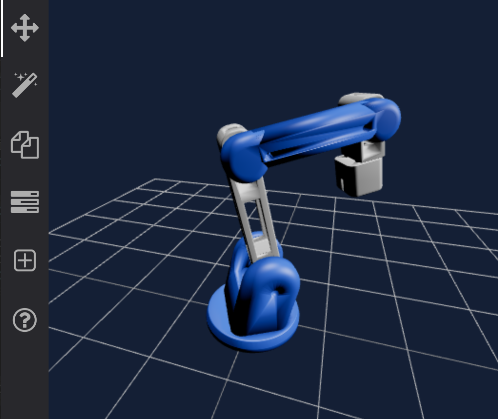

# Robotic Arm Control App

A React web/desktop application to control a custom-built 6-axis robotic arm.

## Submodules

This project is a submodule for the larger [Personal Robotic Arm] project.

- [Kinematics Python Module](https://github.com/calvang/kinematics)

To build it alone, you must clone this repository and initialize submodules.